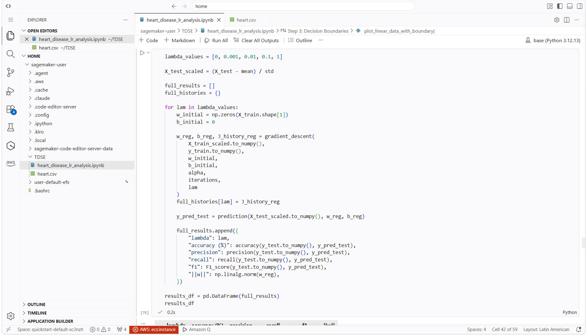
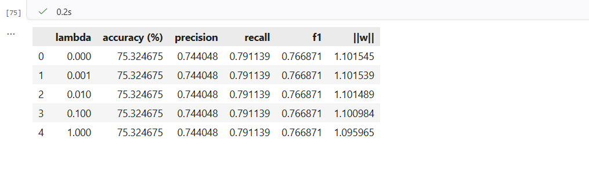
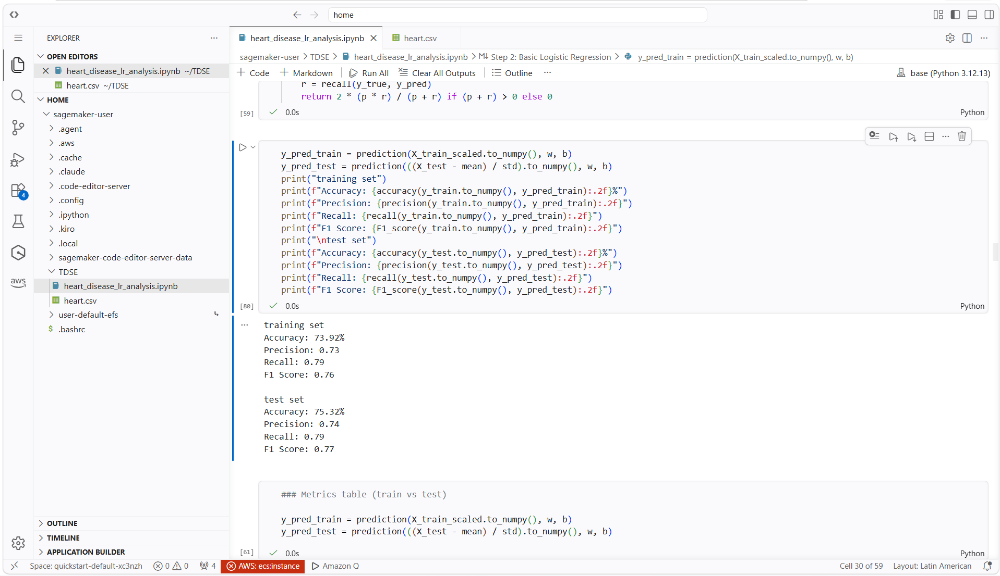

# Heart Disease Risk Prediction

**Nombre:** Nestor David Lopez Castañeda
**Materia:** TSDE - Transformación Digital y Soluciones Empresariales
**Fecha:** 10 de agosto de 2026

---
## Exercise Summary

This project implements logistic regression to predict heart disease using the Heart Disease Dataset from Kaggle.

The exercise covers the complete machine learning process, including data exploration and preparation, model training from scratch, evaluation, decision boundary visualization, L2 regularization, and training and testing the model using AWS Academy SageMaker.

The main objective is to understand how logistic regression works by implementing the main components of the algorithm using NumPy, Pandas, and Matplotlib.

The final cost was approximately:

0.4966

## Dataset Description

The dataset used in this project is the Heart Disease Dataset from Kaggle.

Source: https://www.kaggle.com/datasets/neurocipher/heartdisease


The features include:

- `age`
- `sex`
- `cp`
- `trestbps`
- `chol`
- `fbs`
- `restecg`
- `thalach`
- `exang`
- `oldpeak`
- `slope`
- `ca`
- `thal`
- `target`

The target variable represents whether heart disease is present:

- `0` = absence of heart disease
- `1` = presence of heart disease


For the logistic regression model, six features were selected:

- `age`
- `chol`
- `trestbps`
- `thalach`
- `oldpeak`
- `ca`
## Cost vs Iterations

The cost decreases quickly at the beginning and then becomes more stable as the model approaches a solution.

## Model Evaluation

After training the model, predictions were generated using a threshold of 0.5.

The results were:

| Metric | Training | Test |
|---|---|---|
| Accuracy | 73.92% | 75.32% |
| Precision | 0.73 | 0.74 |
| Recall | 0.79 | 0.79 |
| F1 Score | 0.76 | 0.77 |

The training and test results are fairly close. This means that there is not a large difference between the model's performance on the training data and on unseen test data.

The test accuracy of 75.32% is also higher than the approximately 51% baseline obtained by predicting the majority class.

## Decision Boundaries

To visualize how the model separates the two classes, three pairs of features were selected:

- Age vs Cholesterol
- Resting Blood Pressure vs Maximum Heart Rate
- ST Depression vs Number of Vessels

For each pair, the two features were standardized and a separate logistic regression model was trained.

### Age vs Cholesterol

The age and cholesterol features show considerable overlap between the two classes.

Because both classes appear in similar areas of the graph, a linear decision boundary cannot clearly separate patients with and without heart disease using only these two features.

This suggests that age and cholesterol alone are not enough to make strong predictions.

### Resting Blood Pressure vs Maximum Heart Rate

This pair shows some differences between the two classes, but there is still a considerable amount of overlap.

A linear boundary can separate part of the data, but several observations from both classes remain mixed together.

### ST Depression vs Number of Vessels

This pair shows more noticeable differences between the classes.

However, the classes are still not completely linearly separable, meaning that a simple linear boundary cannot perfectly distinguish between the two groups.

Overall, the models using only two features were weaker than the model using all six selected features. Combining multiple features gives the model more information for making predictions.

## Regularization

L2 regularization was added to the logistic regression cost function and gradients.

The regularization term added to the cost was:

```
lambda / (2m) * ||w||²
```

The gradient was also modified by adding:

```
lambda / m * w
```

The following lambda values were tested:

```
0
0.001
0.01
0.1
1
```

The results on the test set were:

| Lambda | Accuracy | Precision | Recall | F1 | Weight Norm |
|---|---|---|---|---|---|
| 0 | 75.32% | 0.74 | 0.79 | 0.77 | 1.1015 |
| 0.001 | 75.32% | 0.74 | 0.79 | 0.77 | 1.1015 |
| 0.01 | 75.32% | 0.74 | 0.79 | 0.77 | 1.1015 |
| 0.1 | 75.32% | 0.74 | 0.79 | 0.77 | 1.1010 |
| 1 | 75.32% | 0.74 | 0.79 | 0.77 | 1.0960 |

The test metrics stayed the same for all the tested lambda values.

The main difference was the weight norm, which became slightly smaller as lambda increased.

For example:

- lambda = 0 produced a weight norm of 1.1015.
- lambda = 1 produced a weight norm of 1.0960.

This means that regularization reduced the magnitude of the model weights, but it did not produce a measurable change in the test predictions.

### Regularized vs Unregularized Model

The decision boundary of the unregularized model was compared with the boundaries obtained after applying L2 regularization.

The boundary changed only slightly after regularization was added.

This is consistent with the small changes observed in the weight norm and the fact that the evaluation metrics remained unchanged.

The model was not showing a strong overfitting problem, so applying a large amount of regularization was not necessary.

### Choosing Lambda

Based on the lambda-versus-metrics results, all the tested values produced the same test accuracy, precision, recall, and F1 score.

The unregularized model also did not show a clear overfitting problem because the training accuracy was 73.92%, while the test accuracy was 75.32%.

I selected:

```
lambda = 0.1
```

The reason for choosing 0.1 is that it maintains the same test performance while slightly reducing the magnitude of the weights.

Although lambda = 1 reduced the weight norm slightly more, it did not improve any of the evaluation metrics. Therefore, 0.1 was selected as a reasonable value.

## Final Insights

The logistic regression model achieved 75.32% accuracy on the test set, with a precision of 0.74, recall of 0.79, and an F1 score of 0.77.

The full six-feature model performed better than the models that used only two features.

The decision boundary plots showed that the classes are not completely linearly separable when looking at individual feature pairs. There is considerable overlap between patients with and without heart disease.

Some of the selected features, especially thalach, oldpeak, and ca, had a stronger influence on the model's decision function.

The regularization experiment showed that the different lambda values had very little effect on the final metrics. The main effect was a small reduction in the magnitude of the weights.

Overall, logistic regression provides a reasonable baseline for this dataset. However, because it uses a linear decision boundary, it may not capture more complex relationships between the clinical variables.

Possible future improvements include adding feature interactions, polynomial features, or testing a nonlinear classification model.

## SageMaker Evidence

The model was also trained and tested using the AWS Academy SageMaker environment.

SageMaker was used only for the training and testing process.

No inference endpoint was created or deployed.

1. **SageMaker Training**

The following screenshot shows the SageMaker notebook and the model training execution.





2. **Successful Training Completion**

The following screenshot shows that the SageMaker training process completed successfully.



### Comparison with Local Results

The results obtained in SageMaker were the same as the results obtained during the local execution.

| Metric    | Local Result | SageMaker Result |
| --------- | ------------ | ---------------- |
| Accuracy  | 75.32%       | 75.32%            |
| Precision | 0.74         | 0.74              |
| Recall    | 0.79         | 0.79              |
| F1 Score  | 0.77         | 0.77              |

The results are identical for all four metrics. This shows that the model was trained and evaluated consistently in both environments.

The same preprocessing, selected features, train/test split, model parameters, and 0.5 prediction threshold were used. Because of this, SageMaker reproduced the same performance obtained locally.

This also confirms that the model can be executed successfully in the AWS SageMaker environment without changing its results.
## Repository Structure

```
.
├── data/
│   └── heart.csv
├── heart_disease_lr_analysis.ipynb
├── images/
│   ├── cost_vs_iterations.png
│   ├── sagemaker_training.png
│   ├── sagemaker_completed.png
│   └── sagemaker_metrics.png
└── README.md
```

## Requirements

The project uses Python and the following libraries:

- Python 3
- NumPy
- Pandas
- Matplotlib

The core logistic regression model was implemented from scratch, so scikit-learn is not required for the main model.

## How to Run

Install the required libraries:

```
pip install pandas numpy matplotlib
```

Open the notebook:

```
jupyter notebook heart_disease_lr_analysis.ipynb
```

If using VS Code, the notebook can also be opened directly using the Jupyter extension.

Run the notebook cells in order.

The notebook contains the complete process:

1. Load the dataset.
2. Explore the data.
3. Prepare the target variable.
4. Check missing values and statistics.
5. Split the data into training and test sets.
6. Standardize the selected features.
7. Train the logistic regression model.
8. Track the cost during training.
9. Generate predictions.
10. Calculate accuracy, precision, recall, and F1.
11. Generate decision boundary plots.
12. Add L2 regularization.
13. Test different lambda values.
14. Compare regularized and unregularized models.
15. Run the model in the SageMaker environment.

## Conclusion

This project implemented a complete logistic regression workflow for heart disease prediction, including data preparation, model training, evaluation, visualization, regularization, and cloud execution using SageMaker.

The final local model achieved 75.32% test accuracy and an F1 score of 0.77.

The decision boundary analysis showed that the problem is not completely linearly separable using individual pairs of features, while the model using all six features performed better.

The regularization experiment showed that changing lambda had very little effect on the model's performance. A value of 0.1 was selected because it slightly reduced the weight magnitude without changing the evaluation metrics.

The SageMaker section provides evidence that the model was also trained and tested in the AWS Academy environment.
